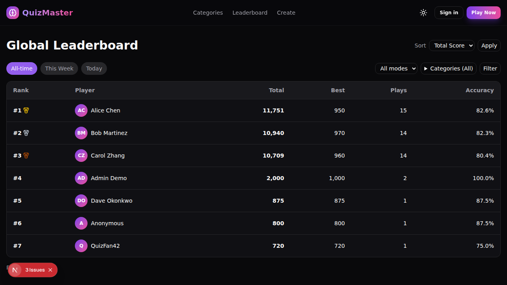
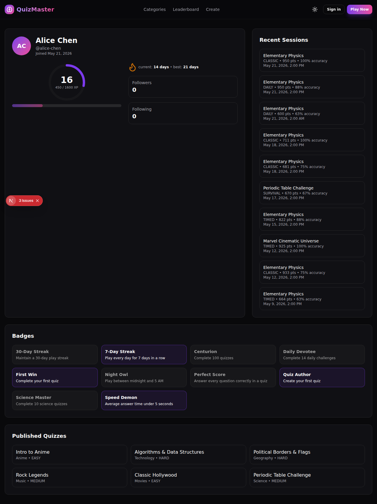
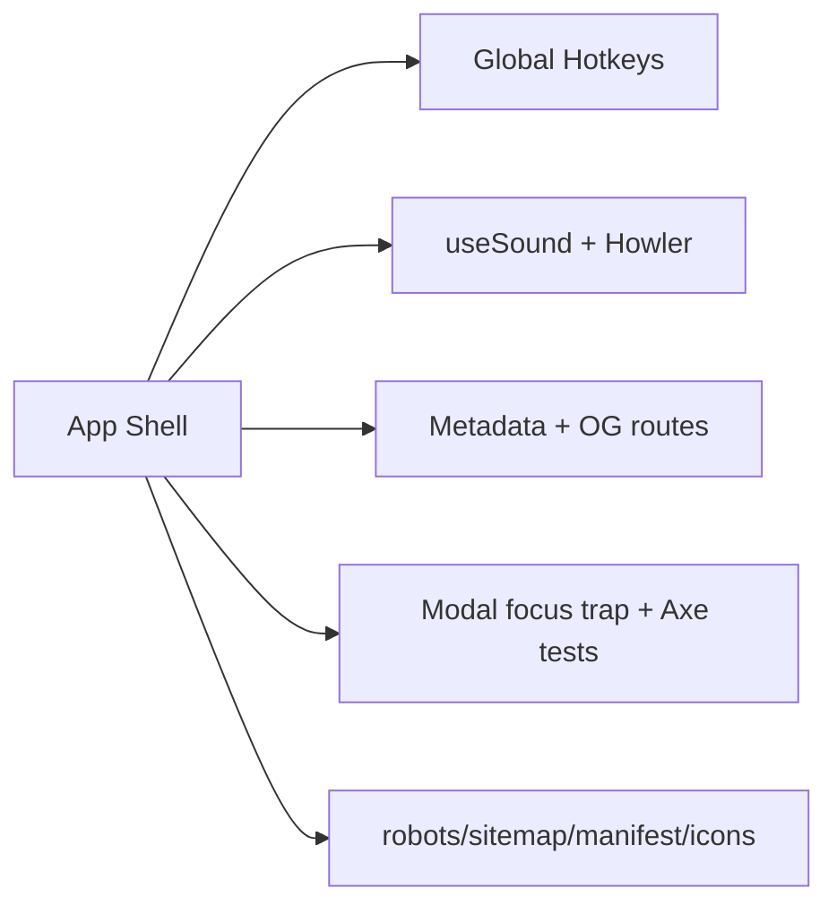

# QuizArena 🧠

A full-featured, Kahoot-inspired quiz platform built with Next.js 16, TypeScript, Tailwind CSS v4, and Prisma.

## 🚀 Quick Start

```bash
npm install
cp .env.example .env
npm run db:push
npm run db:seed
npm run dev
```

Open [http://localhost:3000](http://localhost:3000)

## 🛠 Tech Stack

- **Framework**: Next.js 16 (App Router) + TypeScript
- **Styling**: Tailwind CSS v4 + shadcn/ui + Framer Motion
- **Database**: Prisma ORM + SQLite (dev) / PostgreSQL (prod)
- **Auth**: NextAuth.js (Phase 3+)
- **State**: Zustand
- **Testing**: Vitest + React Testing Library

## 📦 Scripts

| Script                | Description                        |
| --------------------- | ---------------------------------- |
| `npm run dev`         | Start development server           |
| `npm run build`       | Build for production               |
| `npm run lint`        | Run ESLint                         |
| `npm run typecheck`   | Run TypeScript type checker        |
| `npm test`            | Run unit tests                     |
| `npm run db:push`     | Sync Prisma schema → SQLite        |
| `npm run db:seed`     | Seed database with demo content    |
| `npm run db:reset`    | Reset and re-migrate (destructive) |
| `npm run db:generate` | Regenerate Prisma client           |

## 🗂 Project Structure

```
prisma/
├── schema.prisma   # Database schema
├── seed-data.ts    # Seed content (categories, quizzes, etc.)
└── seed.ts         # Seed runner script
src/
├── app/           # Next.js App Router pages
├── components/    # Reusable UI components
│   └── ui/        # Design system primitives
├── lib/           # Utility functions + Prisma client singleton
└── test/          # Test setup and utilities
```

## 🗄️ Phase 2 — Database Setup

The project uses **SQLite** for local development and is designed to be **Postgres-ready** for production (just swap the `provider` and `DATABASE_URL`).

### Setting up the dev database

```bash
cp .env.example .env          # sets DATABASE_URL=file:./dev.db
npm run db:push               # creates prisma/dev.db and syncs schema
npm run db:seed               # populates with demo content
```

### Seeded content

| Entity        | Count |
| ------------- | ----- |
| Categories    | 10    |
| Quizzes       | 30    |
| Questions     | ~100+ |
| Badges        | 10    |
| Demo users    | 5     |
| Play sessions | 48+   |

**Demo users:**

| Name         | Email               | Role  |
| ------------ | ------------------- | ----- |
| Admin Demo   | admin@quizarena.dev | ADMIN |
| Alice Chen   | alice@quizarena.dev | USER  |
| Bob Martinez | bob@quizarena.dev   | USER  |
| Carol Zhang  | carol@quizarena.dev | USER  |
| Dave Okonkwo | demo@quizarena.dev  | USER  |

### Switching to PostgreSQL

1. Change `provider = "sqlite"` to `provider = "postgresql"` in `prisma/schema.prisma`
2. Update `DATABASE_URL` in `.env` to your Postgres connection string
3. Run `npm run db:migrate` instead of `db:push`
4. (Optional) Add back the enum types now that Postgres supports them

## 🔧 Environment Variables

Copy `.env.example` to `.env` and fill in the values:

```bash
cp .env.example .env
```

Generate auth secret:

```bash
openssl rand -base64 32
```

Required auth env vars (Phase 4):

```env
NEXTAUTH_URL="http://localhost:3000"
NEXTAUTH_SECRET=""
AUTH_SECRET=""
GITHUB_CLIENT_ID=""
GITHUB_CLIENT_SECRET=""
GOOGLE_CLIENT_ID=""
GOOGLE_CLIENT_SECRET=""
```

OAuth callback URLs:

- GitHub OAuth app callback URL: `http://localhost:3000/api/auth/callback/github`
- Google OAuth app authorized redirect URI: `http://localhost:3000/api/auth/callback/google`

## 🧯 Troubleshooting

### Theme not switching?

- The root layout now runs a pre-paint theme script before hydration so `<html>` gets the correct `light`/`dark` class immediately.
- Theme-aware components should use semantic Tailwind tokens (`bg-background`, `text-foreground`, `border-border`, etc.) instead of hardcoded color utilities.
- See `docs/theming.md` for the token model and examples.

### Icons not rendering?

- Ensure `lucide-react` is on the supported package line (`0.5xx.x`), not `1.x`.
- If you upgrade icons, run tests to validate all used icon exports still exist (`src/test/lucide-icons.test.ts`).

### DB empty after `npm run db:push`?

- `db:push` only syncs schema. It does not insert data.
- Run `npm run db:seed` after `db:push` to populate demo users, categories, quizzes, and sessions.

## 🧪 Phase 4 — Quiz Creation Studio

Phase 4 introduces authentication and authoring/moderation workflows.

### Sign-in providers

- GitHub OAuth
- Google OAuth
- Credentials provider (guest play by name)

### Studio overview

- `/studio` dashboard with Drafts/Published tabs
- `/studio/quiz/new` and `/studio/quiz/[id]/edit`
- `/studio/quiz/[id]/import` CSV/JSON bulk import

Screenshots:


### CSV import schema

```csv
type,prompt,explanation,timeLimitSec,choices
SINGLE,"What is 2+2?","Basic math",15,"3;*4;5;6"
MULTIPLE,"Which are primes?","",20,"*2;*3;4;*5;6"
TRUEFALSE,"The sky is blue.","",10,"*True;False"
FILL_BLANK,"Capital of France is {{blank}}.","",15,"*Paris;*paris"
```

### JSON import schema

```json
[
  {
    "type": "SINGLE",
    "prompt": "What is 2+2?",
    "explanation": "Basic math",
    "timeLimitSec": 15,
    "choices": [
      { "text": "3", "isCorrect": false },
      { "text": "4", "isCorrect": true }
    ]
  }
]
```

### Roles & permissions

- `USER`: play quizzes, report quizzes, suggest categories, manage own quizzes in studio
- `ADMIN`: all user permissions + moderation queue (`/admin`) with approve/reject/dismiss/unpublish/delete

### Seeded admin sign-in

After `npm run db:seed`, an admin demo account is seeded.  
Use Credentials sign-in with name: **Admin Demo**.

### Updated architecture (Phase 4)

```mermaid
flowchart LR
  UI[Next.js App Router]
  Auth[NextAuth v5]
  Studio[/studio routes]
  Admin[/admin routes]
  API[/app/api/*]
  DB[(Prisma + SQLite/Postgres)]
  U[(User)]
  Q[(Quiz)]
  PS[(PlaySession)]
  A[(Account)]
  S[(Session)]
  VT[(VerificationToken)]
  R[(Report)]
  CS[(CategorySuggestion)]
  AA[(AdminAction)]

  UI --> Auth
  UI --> Studio
  UI --> Admin
  UI --> API
  Auth --> A
  Auth --> S
  Auth --> VT
  Studio --> Q
  Studio --> CS
  API --> PS
  API --> R
  Admin --> CS
  Admin --> R
  Admin --> AA
  DB --- U
  DB --- Q
  DB --- PS
  DB --- A
  DB --- S
  DB --- VT
  DB --- R
  DB --- CS
  DB --- AA
```

## 🏆 Phase 5 — Leaderboards, Profiles & Gamification

### XP formula

`xpForLevel(n) = 100 * (n-1) * n / 2` (total XP required to reach level `n`, with level 1 at 0 XP).

| Level | XP to Reach |
| ----- | ----------- |
| 1     | 0           |
| 2     | 100         |
| 3     | 300         |
| 4     | 600         |
| 5     | 1000        |
| 6     | 1500        |
| 7     | 2100        |
| 8     | 2800        |
| 9     | 3600        |
| 10    | 4500        |

### Win definition

A **win** is any completed session with `correctCount / totalCount >= 0.7` (70% accuracy).

### Streak rules

- Same UTC calendar day as `lastPlayedAt` → no change.
- Yesterday → increment streak by 1.
- Older than yesterday but still within 36h grace from `lastPlayedAt` → increment streak by 1.
- Outside the grace window → reset to 1.
- `bestStreak` is always `max(previousBest, currentStreak)`.

### Badge catalog

| Slug                      | Name           | Criteria                                                              |
| ------------------------- | -------------- | --------------------------------------------------------------------- |
| `first-win`               | First Win      | `{ type: 'wins', count: 1 }`                                          |
| `perfect-score`           | Perfect Score  | `{ type: 'perfectScore' }`                                            |
| `streak-7`                | 7-Day Streak   | `{ type: 'streak', days: 7 }`                                         |
| `streak-30`               | 30-Day Streak  | `{ type: 'streak', days: 30 }`                                        |
| `quiz-author`             | Quiz Author    | `{ type: 'quizzesAuthored', count: 1 }`                               |
| `category-master-science` | Science Master | `{ type: 'categoryMaster', categorySlug: 'science', minQuizzes: 10 }` |
| `speed-demon`             | Speed Demon    | `{ type: 'avgAnswerMs', lt: 5000 }`                                   |
| `night-owl`               | Night Owl      | `{ type: 'playedBetween', fromHour: 0, toHour: 5 }`                   |
| `centurion`               | Centurion      | `{ type: 'playsCount', count: 100 }`                                  |
| `daily-devotee`           | Daily Devotee  | `{ type: 'dailyChallenges', count: 14 }`                              |

### Leaderboard query strategy

- Query source: `PlaySession` filtered by `range`, `mode`, and optional category list.
- Indexes used:
  - `PlaySession(userId)`
  - `PlaySession(createdAt)`
  - `PlaySession(quizId)`
  - composite: `PlaySession(createdAt, mode, quizId)`
- `range` mapping:
  - `all` → no date filter
  - `week` → `createdAt >= now - 7 days`
  - `today` → `createdAt >= UTC day start`
- Expected cost: bounded by filtered `PlaySession` rows; in-memory grouping is O(n) on the filtered subset.

### Screenshots




### Updated architecture (Phase 5)

```mermaid
flowchart LR
  UI[Next.js App Router]
  Auth[NextAuth v5]
  Leaderboard[/leaderboard]
  Profile[/u/[username], /me]
  PlayAPI[/api/play/submit]
  BadgeEngine[src/lib/badges.ts]
  Leveling[src/lib/leveling.ts]
  Streak[src/lib/streak.ts]
  DB[(Prisma)]
  U[(User)]
  PS[(PlaySession)]
  B[(Badge/UserBadge)]
  F[(Follow)]

  UI --> Leaderboard
  UI --> Profile
  UI --> PlayAPI
  UI --> Auth
  PlayAPI --> Leveling
  PlayAPI --> Streak
  PlayAPI --> BadgeEngine
  BadgeEngine --> DB
  Leaderboard --> DB
  Profile --> DB
  DB --- U
  DB --- PS
  DB --- B
  DB --- F
```

## ✨ Phase 6 — Polish & Delight

### Sound system

- New client hook: `src/lib/use-sound.ts` (persisted `soundEnabled`, `soundVolume` in `localStorage`)
- Lazy initialization after first user interaction to avoid autoplay-policy issues
- Wired moments:
  - Quiz start CTA (`start`)
  - Countdown urgency (`tick`, skipped when reduced-motion is enabled)
  - Results celebrations (`level-up`, `badge`)
- Sound assets are bundled in `public/sfx/`

| File           | Purpose                | License             |
| -------------- | ---------------------- | ------------------- |
| `correct.mp3`  | Correct-answer chime   | CC0 / Public Domain |
| `wrong.mp3`    | Wrong-answer buzzer    | CC0 / Public Domain |
| `tick.mp3`     | Countdown urgency tick | CC0 / Public Domain |
| `level-up.mp3` | Level-up fanfare       | CC0 / Public Domain |
| `badge.mp3`    | Badge unlock sparkle   | CC0 / Public Domain |
| `start.mp3`    | Quiz start whoosh      | CC0 / Public Domain |

### Keyboard shortcuts

- `g h` → Home
- `g c` → Categories
- `g l` → Leaderboard
- `g s` → Studio
- `g p` → Profile (`/me`)
- `/` → Focus search (when present)
- `?` → Open shortcuts cheatsheet
- During play: `1-4` answer choices, `Enter` next, `Esc` quit dialog

### Accessibility statement

- Target: WCAG AA contrast and keyboard-only usability
- Skip-to-content link in global shell
- Focus trapping + focus restore in modal dialogs
- Countdown live region announces 10s, 5s, and 0s
- Reduced-motion respected in hot spots (confetti and urgent tick behavior)
- Axe smoke tests added for key routes and configured to fail on `serious`/`critical` violations

### SEO / metadata / OG strategy

- Route-level metadata for `/`, `/categories`, `/quiz/[id]`, `/leaderboard`, `/u/[username]`
- Dynamic OG image routes:
  - `src/app/opengraph-image.tsx`
  - `src/app/quiz/[id]/opengraph-image.tsx`
  - `src/app/u/[username]/opengraph-image.tsx`
  - `src/app/leaderboard/opengraph-image.tsx`
- Crawl / PWA files:
  - `src/app/robots.ts`
  - `src/app/sitemap.ts`
  - `src/app/manifest.ts`
  - `public/icon-192-maskable.png`, `public/icon-512-maskable.png`

OG screenshot:


### Performance notes

- `canvas-confetti` remains dynamically imported at celebration trigger time
- Sound playback is lazily initialized to avoid loading on first paint
- Lighthouse snapshot:


### Updated architecture (Phase 6)



### Roadmap / Future (Out of Scope)

- Real-time multiplayer versus mode
- AI-generated question authoring
- Native mobile app
- Email notifications

## 🏗 Development Phases

- [x] **Phase 1** — Foundation & Design System
- [x] **Phase 2** — Data Model & Seed Content
- [x] **Phase 3** — Core Quiz Gameplay
- [x] **Phase 4** — Quiz Creation Studio
- [x] **Phase 5** — Leaderboards, Profiles & Gamification
- [x] **Phase 6** — Polish & Delight
- [ ] **Phase 7** — Tests & Docs
